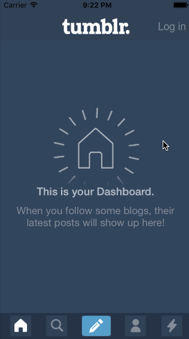

# codepath-tumblr
Tumblr prototype assignment

This is a prototype of Tumblr to demonstrate pulling in view controllers.

Time spent: 6 hours spent in total

Completed user stories:

 * [x] Required: Tapping on Home, Search, Account, or Trending should show the respective screen and highlight the tab bar button.
 * [x] Required: Compose button should modally present the compose screen.
 * [ ] Optional: Compose screen is faded in while the buttons animate in.
 * [ ] Optional: Login button should show animate the login form over the view controller.
 * [ ] Optional: Discover bubble should bob up and down unless the SearchViewController is tapped.
 
Notes:

Couldn't get the compose button animations to work, values were changing in code but not being reflected in the simulator.

Walkthrough of all user stories:

GIF created with [LiceCap](http://www.cockos.com/licecap/).

